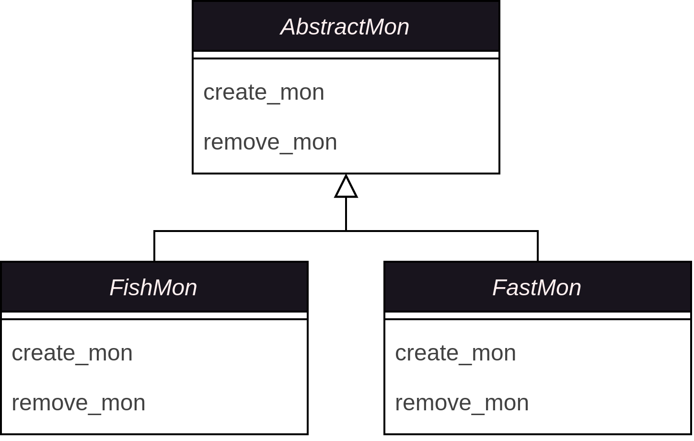

Design Philosophy
=================

DisTRaX is the decedent of DisTRaC, https://github.com/rosalindfranklininstitute/DisTRaC, which was designed to deploy a ceph storage cluster onto a High-Performance Computer Cluster. As a project, it served as a minimal viable product of the DisTRa idea (https://arxiv.org/pdf/2212.03054.pdf). However, as a software package, it needed more clean documentation and an easier way to distribute, maintain, and update or fix. Many of these issues arose because it was written in bash, which is unsuitable for large programs. Motivated by these problems, DisTRaX has been designed to solve all of these issues.

Extensible by Design
--------------------

Heavily inspired by the Ceph Storage cluster, we have split the main components of the cluster build and destroy process into seven parts.

* Monitor (mons)
* Manager (mgrs)
* Object Storage Device (osds)
* Metadata server (mds)
* Pools (pools)
* Gateways (gateways)
* Filesystem (filesystems)

Each of one of the components has an abstract base class [#]_  which states the functionality required and provides the template for how the component should be implemented. The naming convention for these classes is the storage system name followed by the component, i.e. if the storage system is called Fast and we are implementing the monitor it would be FastMon. An example of the Monitor implemented for the Storage systems Fish and Fast is shown below:

|Abstract Base Class|

This design practice allows for multiple storage systems to be supported by DisTRaX and we welcome pull requests adding such.

.. [#] Strictly speaking these are implemented as protocols in python such that it runtime checkable, this is done via type checking instead of inheritance.

Minimal Dependencies
--------------------

DisTRaX has been designed to have minial dependencies on top of the requirements for the respective storage system. This improves the overall security of the system and makes the application easier to maintain.
